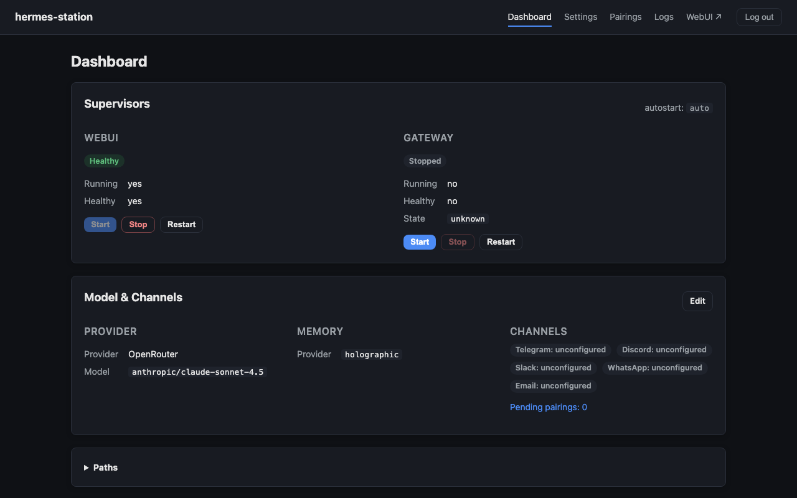
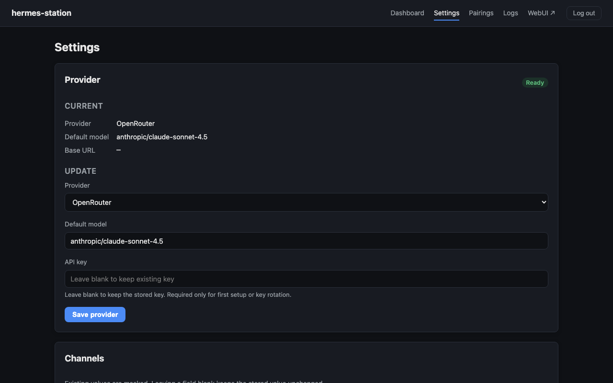

# hermes-station

[Hermes Agent](https://github.com/NousResearch/hermes-agent) is an open-source AI assistant you run on your own infrastructure. You connect it to the LLM provider of your choice and it reaches users over Telegram, Discord, Slack, email, and other channels. hermes-station is the easiest way to self-host it: a single container that bundles the agent, the web chat UI, and a browser-based setup wizard, deployable to Railway or runnable locally with Docker or Apple `container`. Your data and API keys stay on your infrastructure — nothing is routed through a third-party service.

[](https://railway.com/deploy/hermes-station?referralCode=wNX0xW)

## What this is

A single Railway-deployable container that runs:

- `/` — the Hermes WebUI
- `/admin` — control plane: browser-based provider/channel setup, gateway controls, logs
- `/health` — healthcheck

Everything writes to `/data` (single Railway volume) and shares one Hermes identity across WebUI, Telegram, Discord, Slack, and other channels. See `docs/CONTRACT.md` §3 for the full filesystem layout.





## Volume compatibility

hermes-station is engineered to accept an existing Hermes `/data` volume unchanged. The CI compat test (`tests/test_compat.py`) boots the container against a fixture `/data` snapshot and asserts the contract holds. If that test is green for a given upstream version combo, the image is a verified drop-in.

## Upstream tracking

Both upstreams move fast (hermes-agent: weekly, hermes-webui: several releases/day). We pin exact versions and let Renovate open weekly batched bump PRs; CI runs the compat test; auto-merge on green.

- `hermes-agent` — pinned in `pyproject.toml` via `git+https://...@<tag>`. Tracked by Renovate's PEP 621 manager.
- `hermes-webui` — pinned in `Dockerfile` via `ARG HERMES_WEBUI_VERSION`. Tracked by Renovate's regex manager (`renovate.json5`).

See `renovate.json5` for the schedule and `.github/workflows/ci.yml` for the gate.

## Local development

```bash
# Build
docker build -t hermes-station:local .
# (or `container build` — Apple's container CLI is a drop-in)

# Run with a fresh /data
mkdir -p /tmp/hermes-station-data
docker run --rm -d --name hermes-station -p 8787:8787 \
  -e HERMES_WEBUI_PASSWORD=dev -e HERMES_ADMIN_PASSWORD=dev \
  -v /tmp/hermes-station-data:/data \
  hermes-station:local

# Smoke
curl http://127.0.0.1:8787/health
```

Apple `container` and `docker` are both supported (commands are compatible enough for the build/run flow used here).

## Running it yourself

hermes-station is **warn-and-continue on first boot**: the container starts on an empty `/data` with zero secrets, `/health` reports `degraded`, and the admin UI walks you through configuration. Nothing is required to get a running process.

### What you can configure

The first two things to set for any non-local deployment are `HERMES_ADMIN_PASSWORD` and `HERMES_WEBUI_PASSWORD` — without them, both UIs are open. After that, capabilities (LLM providers, Discord, web search, image gen, etc.) unlock as you add the corresponding secrets.

See [`docs/configuration.md`](docs/configuration.md) for the full env-var reference, the first-boot config seeding behavior, and the warn-and-continue capability model. A minimal starter `config.yaml` lives at [`docs/config.example.yaml`](docs/config.example.yaml).

### Checking status

Three health endpoints, intended for different consumers:

- `GET /health/live` — process is alive. Cheap; suitable for orchestrator **liveness** probes.
- `GET /health/ready` — composite ready check. Returns `503` when degraded; suitable for orchestrator **readiness** probes.
- `GET /health` — full JSON, **always 200**. The body's `status` field carries the verdict (`ok` / `degraded` / `down`) so dashboards can read it without treating non-2xx as fatal.

Example `/health` body on a fresh boot with `HERMES_ADMIN_PASSWORD` set and **no** `OPENROUTER_API_KEY` — the auto-seeder finds nothing to seed, so no `provider:*` row appears:

```json
{
  "status": "degraded",
  "components": {
    "control_plane": {"state": "ready"},
    "webui":         {"state": "ready", "pid": 42},
    "gateway":       {"state": "stopped"},
    "scheduler":     {"jobs": null, "last_run_at": null},
    "storage":       {"data_writable": true, "config_readable": true},
    "memory":        {"provider": "holographic", "db_ok": true}
  },
  "readiness": {
    "discord":            {"intended": false, "ready": false},
    "web_search":         {"intended": false, "ready": false},
    "image_gen":          {"intended": false, "ready": false},
    "github":             {"intended": false, "ready": false},
    "memory:holographic": {"intended": true,  "ready": true}
  },
  "versions": {
    "hermes_station": "0.1.x",
    "hermes_agent":   "0.x.y",
    "hermes_webui":   "v0.51.x",
    "python":         "3.12.x",
    "image_revision": "dev"
  },
  "boot_at": "2026-05-15T12:34:56+00:00",
  "summary": {
    "image_revision": "dev",
    "hermes_agent":   "0.x.y",
    "hermes_webui":   "v0.51.x",
    "python":         "3.12.x",
    "platforms":      [],
    "toolsets":       []
  }
}
```

`status: "degraded"` here is operational (the gateway is stopped pending a provider) — no readiness rows are `intended: true && ready: false`. Visit `/admin` to add a provider key, or set `OPENROUTER_API_KEY` (etc.) at boot to skip the manual step.

Same fresh boot **with `OPENROUTER_API_KEY` set** — the seeder writes `model.provider: openrouter` to `config.yaml` on first start, so a `provider:openrouter` readiness row appears and `status` flips to `ok`:

```json
{
  "status": "ok",
  "components": {
    "control_plane": {"state": "ready"},
    "webui":         {"state": "ready", "pid": 42},
    "gateway":       {"state": "running"},
    "scheduler":     {"jobs": null, "last_run_at": null},
    "storage":       {"data_writable": true, "config_readable": true},
    "memory":        {"provider": "holographic", "db_ok": true}
  },
  "readiness": {
    "discord":             {"intended": false, "ready": false},
    "provider:openrouter": {"intended": true,  "ready": true,  "source": "process_env"},
    "web_search":          {"intended": false, "ready": false},
    "image_gen":           {"intended": false, "ready": false},
    "github":              {"intended": false, "ready": false},
    "memory:holographic":  {"intended": true,  "ready": true}
  },
  "versions": {
    "hermes_station": "0.1.x",
    "hermes_agent":   "0.x.y",
    "hermes_webui":   "v0.51.x",
    "python":         "3.12.x",
    "image_revision": "a1b2c3d4e5f6789012345678901234567890abcd"
  },
  "boot_at": "2026-05-15T12:34:56+00:00",
  "summary": {
    "image_revision": "a1b2c3d4e5f6789012345678901234567890abcd",
    "hermes_agent":   "0.x.y",
    "hermes_webui":   "v0.51.x",
    "python":         "3.12.x",
    "platforms":      [],
    "toolsets":       []
  }
}
```

A capability listed in `config.yaml` but missing its secret shows up as `ready: false` with a `reason`; the container does **not** exit. The exact seeder behavior (precedence, default models, no-clobber) is documented in [`docs/configuration.md`](docs/configuration.md#provider-auto-seed) and pinned by [`tests/test_config_seed_provider.py`](tests/test_config_seed_provider.py).

### Version visibility

To see exactly which `hermes-station`, `hermes-agent`, `hermes-webui`, and image revision a deployment is running:

```bash
curl https://your-app/health | jq .versions
```

`image_revision` is the git SHA the image was built from (or `"dev"` for a local `docker build .`).

### Structured logs

Stdout is JSON, one object per line, with `ts`, `level`, `component`, `event`, `message`, and contextual extras. Pipe to `jq` for filtering:

```bash
# Readiness checks only
container logs hermes-station | jq 'select(.component=="readiness")'

# Just warnings and errors
container logs hermes-station | jq 'select(.level=="warning" or .level=="error")'
```

## License

MIT — see `LICENSE`. The pinned upstreams (`hermes-agent`, `hermes-webui`) are also MIT.
